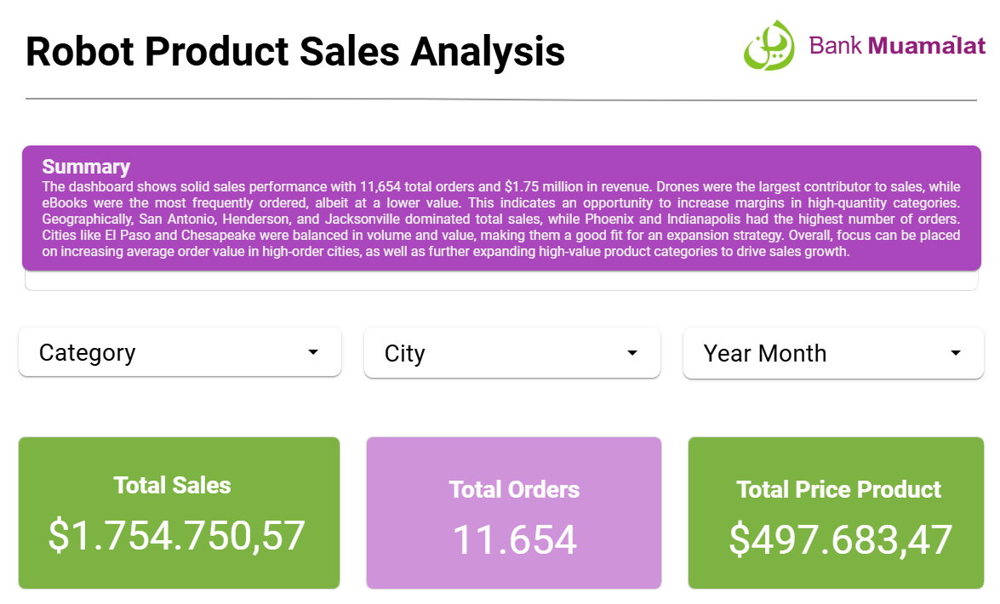

# 📊 Robot Sales Analytics Dashboard



This project aims to perform an in-depth analysis of robot sales data from various product, category, customer, and region perspectives using SQL and interactive dashboard visualization.

## 🧾 Project Description

This dashboard is designed to provide actionable business insights for stakeholders, such as:

- Total sales
- Total sales by product category
- Total quantity by product category
- Total sales by city
- Total quantity by city
- Top 5 highest-selling product categories
- Top 5 highest-selling product categories

## 📂 Project Structure

├── data/

│ ├── Customers.csv

│ ├── Orders.csv

│ ├── OrdersSalesDetail.csv

│ ├── Products.csv

│ └── ProductCategory.csv

├── dashboard/

│ └── Link_Robots_Sales_Products_Dashboard.txt

│ └── Robots_Sales_Products_Dashboard.pdf

│ └── Robots_Sales_Products_Dashboard.png

├── sql/

│ ├── sales_orders_detail_query.sql

├── README.md


## 🗃️ Dataset

Here is a description of the data files used:

| File Name | Description |
|---------|----------------------------------------------------|
| `Product.csv` | Product data including name and base price |
| `ProductCategory.csv` | Product category data |
| `Customer.csv` | Customer information including segment and city |
| `Order.csv` | Order data (date, channel, etc.) |
| `OrderSalesDetail.csv` | Sales details per product per order |

## 🔍 Analysis Methodology

The analysis was performed by aggregating various datasets to create a master dataset named `SalesOrdersDetail.csv` in **BigQuery** and visualizing the report dashboard in **looker studio**.

### Query

```sql
SELECT
  o.Date AS order_date,
  pc.CategoryName AS category_name,
  p.ProdName AS product_name,
  p.Price AS product_price,
  o.Quantity AS order_qty,
  o.Quantity * p.Price AS total_sales,
  c.CustomerEmail AS cust_email,
  c.CustomerCity AS cust_city
FROM
  `robots_sales_dataset.orders` o
JOIN
  `robots_sales_dataset.products` p
ON
  o.ProdNumber = p.ProdNumber
JOIN
  `robots_sales_dataset.product_category` pc
ON
  p.Category = pc.CategoryID
JOIN
  `robots_sales_dataset.customers` c
ON
  o.CustomerID = c.CustomerID
ORDER BY
  order_date;
```

### Query Results


### Dashboard

Dashboard Link= [Robot Product Sales Analysis](https://lookerstudio.google.com/reporting/e3c0fe6d-7698-4d39-9d90-b74eaa64965a)


## Tools & Technology
- BigQuery for query execution

- Looker Studio for visualization

- Excel and CSV for storing datasets and initial tables

## 📊 Sales Insights and Recommendations

### 📌 1. Focus on High-Sales Categories
Drone Kits and Robots have the highest sales by value (`total_sales`).

**Suggestion:**
- Continue major promotions for these categories (discounts, bundling).
- Add new product variants or features in these categories.
- Offer loyalty points or cashback for purchases of products in these categories.

---

### 📌 2. Optimize High-Quantity Products
eBooks and Young Learning Kits have high sales volume but lower sales value.

**Suggestion:**
- Increase margins by bundling or upselling related products (e.g., selling eBooks + lab tools).
- Enhance the digital experience to make eBooks more premium (exclusive access, certificates, etc.).

---

### 📌 3. Focus on Cities with Highest Sales
Cities like **San Antonio**, **Henderson**, **Jacksonville**, and **El Paso** show high sales.

**Suggestion:**
- Increase personalization and location-based advertising campaigns in these cities.
- Partner with local communities, brick-and-mortar stores, or even workshops.

---

### 📌 4. Potential Cities with High Orders but Low Value
Cities like **Phoenix** and **Indianapolis** have high order volumes but may have low value per order.

**Suggestion:**
- Increase Average Order Value (AOV) through “Buy more, save more” promotions.
- Evaluate whether low-priced products are overly dominant and try pushing higher-priced products.

---

### 📌 5. Product Diversification in Less Popular Categories
Some categories, such as Drone Kits or Training Materials, have low quantity but high value.

**Suggestion:**
- Educate the market about the benefits of products in these categories (using video content/tutorials).
- Use popular category products as an entry point to sell products from more niche categories.

---

### 📌 6. Purchase Behavior Analysis
Because the data has `order_date` and `email` attributes, customer segmentation can be done based on:

- Loyal vs. new customers.
- Purchase frequency.

**Suggestion:**
- Send exclusive offers to loyal customers.
- Provide incentives for first purchases for new customers.

## 🙋‍♂️ Contributor
Name: Defrizal Yahdiyan Risyad

Email: defrijay@gmail.com

LinkedIn : [Defrizal Yahdiyan Risad Linkedln](https://www.linkedin.com/in/defrizal-yahdiyan-risyad-221327209/)
