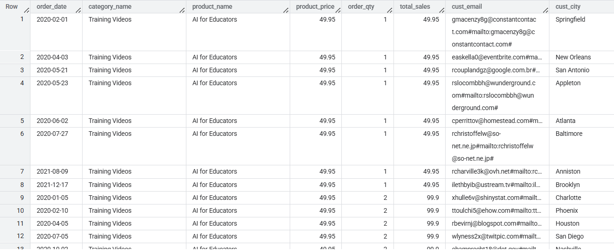
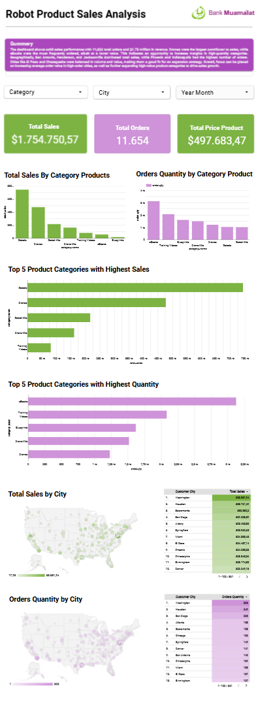

# 📊 Robot Sales Analytics Dashboard

Proyek ini bertujuan untuk melakukan analisis mendalam terhadap data penjualan robot dari berbagai perspektif—produk, kategori, pelanggan, dan wilayah—menggunakan SQL dan visualisasi dashboard interaktif.

## 🧾 Deskripsi Proyek

Dashboard ini dirancang untuk memberikan wawasan bisnis yang dapat ditindaklanjuti bagi pemangku kepentingan, seperti:

- Total keseluruhan sales
- Total keseluruhan sales berdasarkan kategori produk
- Total keseluruhan qty berdasarkan kategori produk
- Total sales berdasarkan kota 
- Total qty berdasarkan kota
- Top 5 kategori produk yang paling tinggi salesnya
- Top 5 kategori produk yang paling tinggi qtynya

## 📂 Struktur Proyek

├── data/

│ ├── Customers.csv

│ ├── Orders.csv

│ ├── OrdersSalesDetail.csv

│ ├── Products.csv

│ └── ProductCategory.csv

├── dashboard/

│ └── Link_Robots_Sales_Products_Dashboard.txt

│ └── Robots_Sales_Products_Dashboard.pdf

│ └── Robots_Sales_Products_Dashboard.png

├── sql/

│ ├── sales_orders_detail_query.sql

├── README.md


## 🗃️ Dataset

Berikut adalah deskripsi file data yang digunakan:

| Nama File               | Deskripsi                                      |
|------------------------|-----------------------------------------------|
| `Products.csv`         | Data produk termasuk nama dan harga dasar     |
| `ProductCategory.csv`  | Data kategori produk                          |
| `Customers.csv`        | Informasi pelanggan termasuk segment dan kota |
| `Orders.csv`           | Data pesanan (tanggal, channel, dsb)         |
| `OrdersSalesDetail.csv` | Detail penjualan per produk per pesanan     |

## 🔍 Metodologi Analisis

Analisis dilakukan dengan melakukan agregasi di berbagai dataset sehingga terbentuk master dataset yang bernama `SalesOrdersDetail.csv` di **BigQuery** dan divisiualisasikan dashboard laporannya di **looker studio**.

### Query Agregasi

```sql
SELECT
  o.Date AS order_date,
  pc.CategoryName AS category_name,
  p.ProdName AS product_name,
  p.Price AS product_price,
  o.Quantity AS order_qty,
  o.Quantity * p.Price AS total_sales,
  c.CustomerEmail AS cust_email,
  c.CustomerCity AS cust_city
FROM
  `robots_sales_dataset.orders` o
JOIN
  `robots_sales_dataset.products` p
ON
  o.ProdNumber = p.ProdNumber
JOIN
  `robots_sales_dataset.product_category` pc
ON
  p.Category = pc.CategoryID
JOIN
  `robots_sales_dataset.customers` c
ON
  o.CustomerID = c.CustomerID
ORDER BY
  order_date;
```

### Hasil Query Agregasi


### Dashboard

Link Dashboard = [Robot Product Sales Analysis](https://lookerstudio.google.com/reportinge3c0fe6d-7698-4d39-9d90-b74eaa64965a)



## Tools & Teknologi
- BigQuery untuk eksekusi query

- Looker Studio untuk visualisasi

- Excel dan CSV untuk penyimpanan dataste awal

## 📊 Insight dan Rekomendasi Penjualan

### 📌 1. Fokus pada Kategori dengan Penjualan Tinggi
**Drone Kits** dan **Robots** memiliki penjualan tertinggi berdasarkan nilai (`total_sales`).

**Usulan:**
- Lanjutkan promosi besar untuk kategori ini (diskon, bundling).
- Tambahkan varian produk atau fitur baru dalam kategori ini.
- Tawarkan loyalty points atau cashback untuk pembelian produk dalam kategori ini.

---

### 📌 2. Optimalisasi Produk dengan Kuantitas Tinggi
**eBooks** dan **Young Learning Kits** memiliki volume penjualan tinggi tetapi nilai penjualannya lebih rendah.

**Usulan:**
- Naikkan margin dengan bundling atau upselling produk terkait (misalnya: jual eBooks + alat praktikum).
- Tingkatkan pengalaman digital agar eBooks jadi lebih premium (akses eksklusif, sertifikat, dsb).

---

### 📌 3. Fokus pada Kota dengan Penjualan Tertinggi
Kota seperti **San Antonio**, **Henderson**, **Jacksonville**, dan **El Paso** menunjukkan penjualan tinggi.

**Usulan:**
- Tingkatkan personalisasi dan kampanye iklan berbasis lokasi di kota-kota ini.
- Kerja sama dengan komunitas lokal, toko offline, atau even workshop.

---

### 📌 4. Potensi Kota dengan Order Tinggi tetapi Nilai Rendah
Kota seperti **Phoenix** dan **Indianapolis** memiliki jumlah pesanan tinggi tetapi mungkin nilai per order-nya rendah.

**Usulan:**
- Naikkan *Average Order Value (AOV)* melalui promosi “Beli lebih, hemat lebih”.
- Evaluasi apakah produk-produk murah terlalu mendominasi dan coba dorong produk dengan harga lebih tinggi.

---

### 📌 5. Diversifikasi Produk di Kategori Kurang Populer
Beberapa kategori seperti **Drone Kits** atau **Training Materials** punya kuantitas rendah tapi nilai tinggi.

**Usulan:**
- Edukasi pasar tentang manfaat produk kategori ini (pakai konten video/tutorial).
- Gunakan produk kategori populer sebagai *entry-point* untuk menjual produk dari kategori yang lebih *niche*.

---

### 📌 6. Analisis Perilaku Pembelian
Karena data memiliki atribut `order_date` dan `email`, segmentasi pelanggan bisa dilakukan berdasarkan:

- Pelanggan setia vs. baru.
- Frekuensi pembelian.

**Usulan:**
- Kirimkan penawaran eksklusif untuk pelanggan setia.
- Berikan insentif pada pembelian pertama untuk pelanggan baru.


## 🙋‍♂️ Kontributor
Nama: Defrizal Yahdiyan Risyad

Email: defrijay@gmail.com

LinkedIn : [Defrizal Yahdiyan Risad Linkedln](https://www.linkedin.com/in/defrizal-yahdiyan-risyad-221327209/)